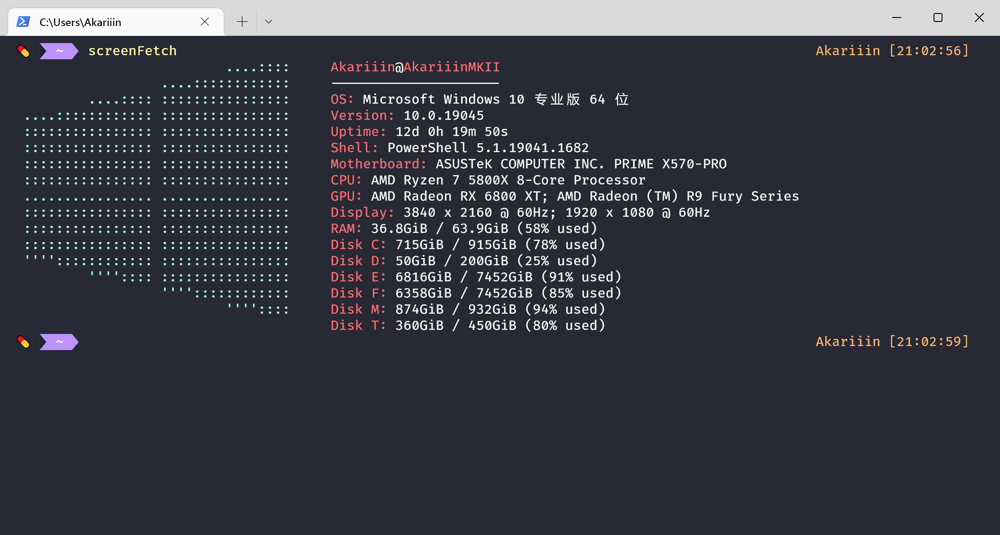
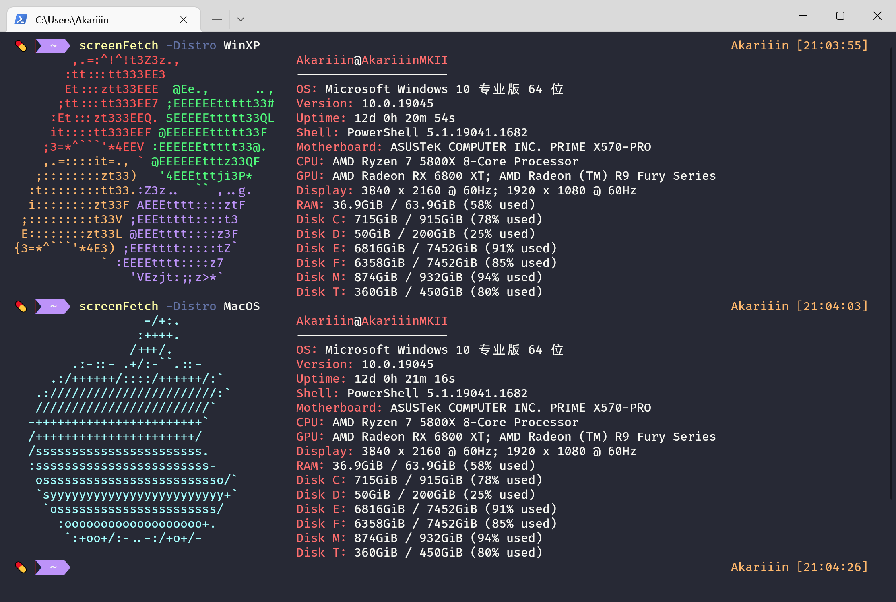

# Windows screenFetch

_Original by [JulianChow94](https://github.com/JulianChow94/Windows-screenFetch), modified in this repo._



> ## ScreenFetch
>
> screenFetch was originally made as a "Bash Screenshot Information Tool". Simply, it lets you display detailed information about your system in the terminal, it also comes with a ASCII logo for the detected Linux distribution.
>
> This doesn't work on Windows natively and this project is my attempt to provide a solution that does not require obtaining a linux environment on windows.
>
> The original can be found in [KittyKatt's repository](https://github.com/KittyKatt/screenFetch).
>
> ## How is it different
>
> The original screenfetch requires a system that supports bash so it cannot be used on windows natively! This is a small scale project that simply "mimics" the behaviour of screenFetch in windows.
>
> __Windows screenFetch is a PowerShell script, not a Bash program.__ Therefore, a linux-like environment such as [Cygwin](https://www.cygwin.com/) or [MinGW](http://www.mingw.org/wiki/msys) is ___not required___. This can be run natively on windows as a PowerShell script within a PowerShell or command prompt console.
>
> _Since this tool is only intended to run within a windows environment, no flags to invoke any Linux distribution ASCII art is supported._

## Installation

- ### Via [Scoop](https://github.com/ScoopInstaller/Scoop)

```PowerShell
# Add scoop bucket
scoop bucket add Scoop4kariiin https://github.com/AkariiinMKII/Scoop4kariiin

# Install
scoop install Windows-screenFetch
```

- ### Via git clone

Notice that you need to install [git for windows](https://gitforwindows.org/) in advance.

```PowerShell
# Go to modules folder
$UsePath = (Split-Path $PROFILE | Join-Path -ChildPath Modules); if(!(Test-Path $UsePath)) {New-Item $UsePath -Type Directory -Force | Out-Null}; Set-Location $UsePath

# Clone this repository
git clone https://github.com/AkariiinMKII/Windows-screenFetch

# Modify PS profile to enable auto-import
if (!(Test-Path $PROFILE)) {New-Item $PROFILE -Type File -Force | Out-Null}
Add-Content -Path $PROFILE -Value "Import-Module Windows-screenFetch"
```

## Functions

### `screenFetch`

_A command performs like it in bash._

#### `-distro <LogoName>`

_Specify the ASCII logo shown._

Currently support the logo of Mac and Windows XP, please see `AsciiArtGenerator` for possible extensions

- For Mac logo, use `mac`, `macos`, `osx`, `apple`
- For Windows XP logo, use `winxp`, `windowsxp`, `xp`, `"win xp"`, `"windows xp"`



## Troubleshooting

If you have followed the installation steps but you're getting the following error:

```PowerShell
The file C:\<yourpath>\screenfetch.ps1 is not digitally signed.
The script will not execute on the system.
```

A common fix is to run the PowerShell command `Set-ExecutionPolicy Unrestricted` in a shell with administrative privileges.

## Known issues

- Cannot get physical resolution in `Display` area. [(#3)](https://github.com/AkariiinMKII/Windows-screenFetch/issues/3)

## Contributing

Feel free to open PRs!🥳
