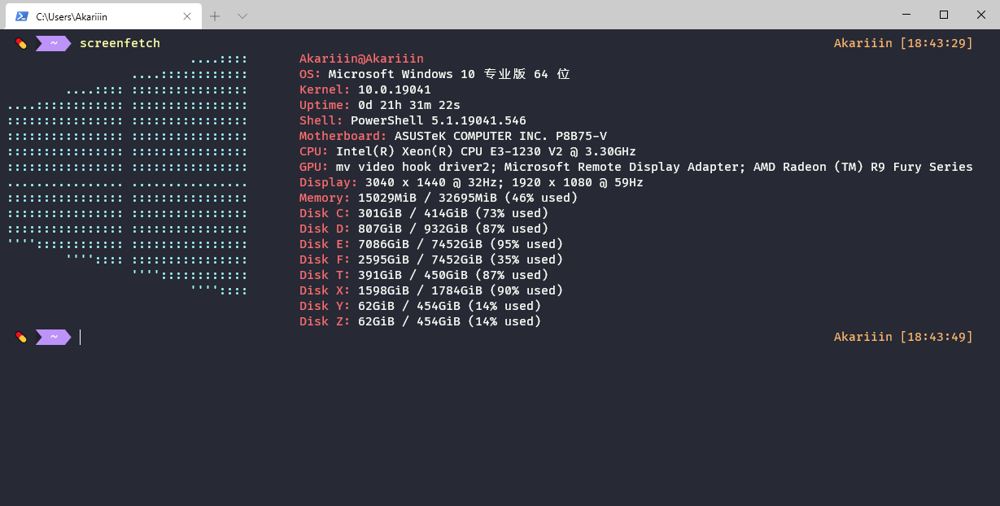
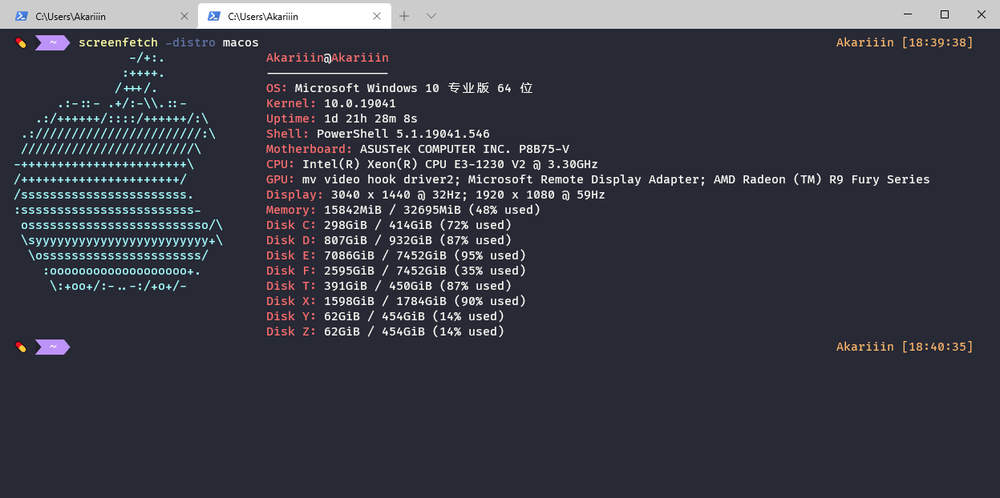

# Windows screenFetch

_Original by [JulianChow94](https://github.com/JulianChow94/Windows-screenFetch), modified in this repo._



## ScreenFetch

---

screenFetch was originally made as a "Bash Screenshot Information Tool". Simply, it lets you display detailed information about your system in the terminal, it also comes with a ASCII logo for the detected Linux distribution.

This doesn't work on Windows natively and this project is my attempt to provide a solution that does not require obtaining a linux environment on windows.

The original can be found in [KittyKatt's repository](https://github.com/KittyKatt/screenFetch).

## How is it different

---
The original screenfetch requires a system that supports bash so it cannot be used on windows natively! This is a small scale project that simply "mimics" the behaviour of screenFetch in windows.

**Windows screenFetch is a Powershell script, not a Bash program**. Therefore, a linux-like environment such as [Cygwin](https://www.cygwin.com/) or [MinGW](http://www.mingw.org/wiki/msys) is ***not required***. This can be run natively on windows as a Powershell script within a Powershell or command prompt console.

*Since this tool is only intended to run within a windows environment, no flags to invoke any Linux distribution ASCII art is supported.*

## Installation

---

### Git clone

**Step 1.** Go to PowerShell module path, check by

```powershell
$env:PSModulePath -Split ";"
```

**Step 2.** Clone this repository

```bash
git clone https://github.com/AkariiinMKII/Windows-screenFetch
```

### Powershell Gallery (not recommended)

Windows-screenfetch module in [Powershell Gallery](https://www.powershellgallery.com/packages/windows-screenfetch) is outdated, with several issues not solved.

```powershell
Install-Module -Name windows-screenfetch
```

Simply run the `screenfetch` command after installing the module and you should be good to go.

**Note** that if you were using windows-screenfetch before it was uploaded to Powershell Gallery, you will need to delete the local instance and associated environment variables before running the following install.

### ~~Command Prompt~~

No longer supported

### Usage Parameters

---

- The `-distro` argument allows you to specify the ASCII logo shown

- Possible alternatives currently is the apple logo, please see `AsciiArtGenerator` for possible extensions

  

## Troubleshooting

---
If you have followed the installation steps but you're getting the following error:

```powershell
The file C:\<yourpath>\screenfetch.ps1 is not digitally signed.
The script will not execute on the system.
```

A common fix is to run the powershell command `Set-ExecutionPolicy Unrestricted` in a shell with administrative privileges.

## Contact Me

---
Below are my two most active social portals

- `julianchow@outlook.com`
- <https://twitter.com/JulianChow94>
